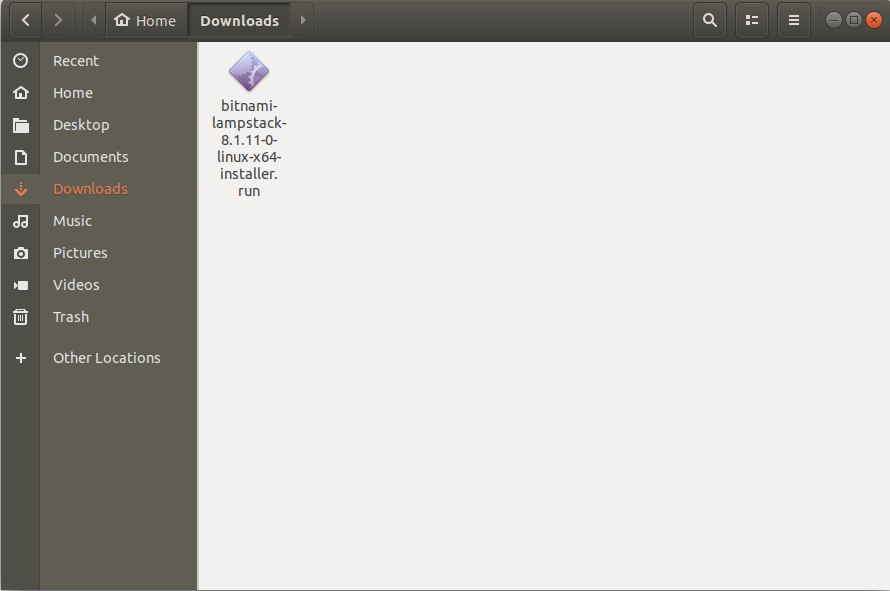
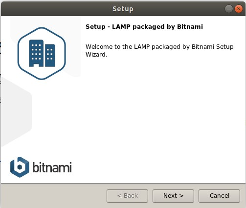
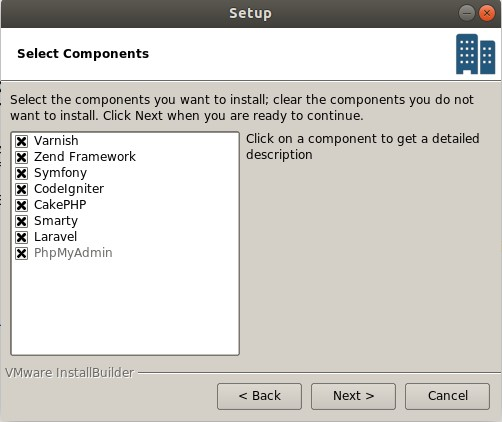
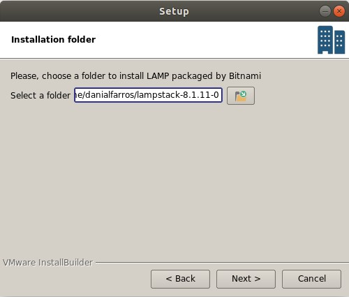
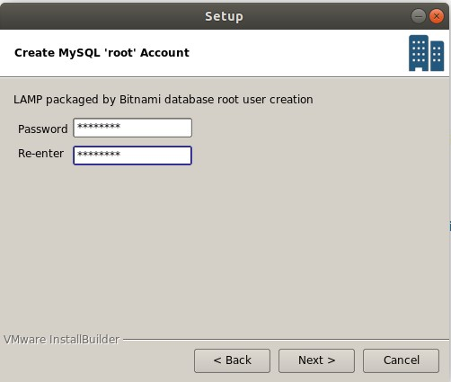
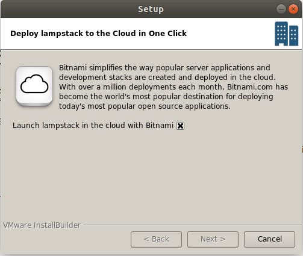
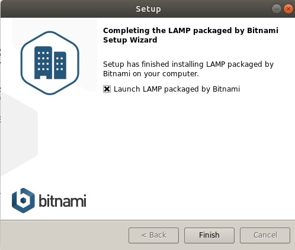
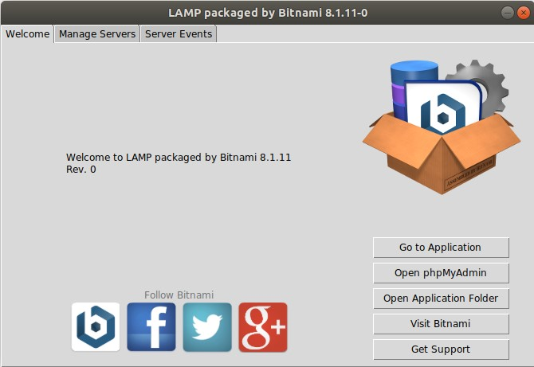
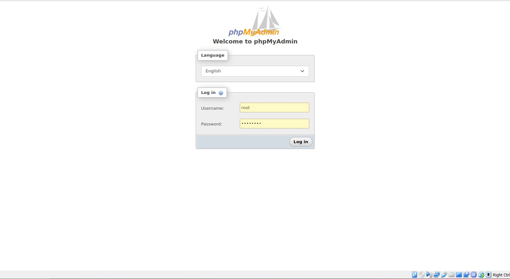

## APA ITU LAMP

Lampp merupakan singkatan dari Linux, Apache, MySQL, perl/php/python. Merupakan sebuah paket perangkat lunak bebas yang digunakan untuk menjalankan sebuah aplikasi secaralengkap

Komponen-komponen dari LAMP:
- **Linux** sebagai sistem operasi
- **Apache** HTTP Server sebagai web server
- **MySQL** sebagai sistem basis data
- **Perl** atau PHP atau Pyton sebagai bahasa pemrograman yang dipakai

Beberapa perangkat lunak yang menggunakan konfigurasi LAMP antara lain MediaWiki dan Bugzilla.

## Cara instalasi

 1. file instalasi dapat di download [di sini](https://bitnami.com/stack/lamp/installer)
 2. langsung saja di install tadi downloadnya 
   
   

 3. langsung di klik next aja
   
   
   
   

 4. ketikkan password yang mau dugunakan untuk akun SQL  
     
   
   
   
   

 5. Instalasi selesai LAMMP dapat di gunakan
   
   

Gunakan username `root` dan password yang di masukkan pada saat instalasi untuk menggunakan phpMyAdmin

